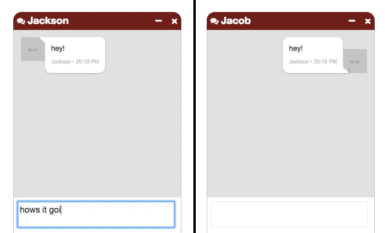
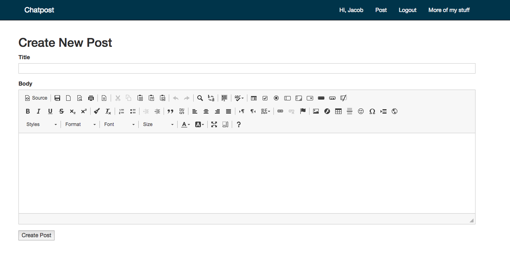
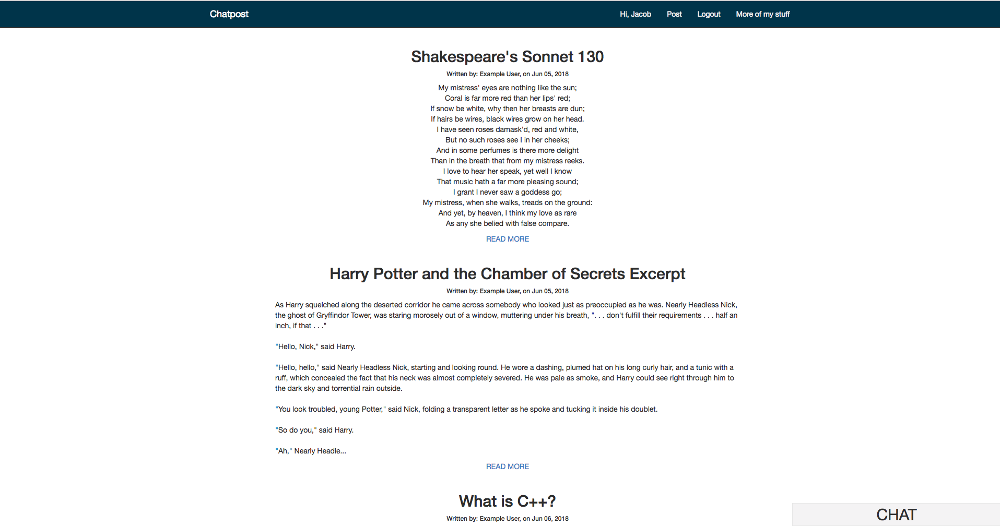
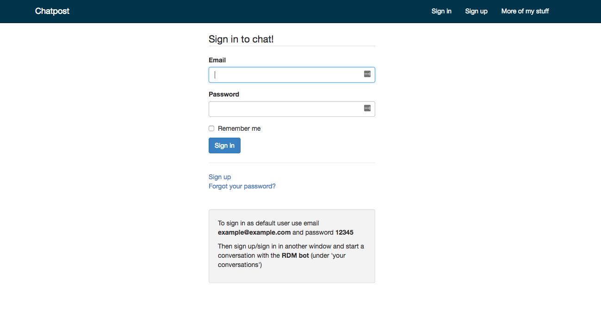

[]()

A Ruby on Rails social media platform. Includes an instant messaging platform and posting.
An API has also been implemented allowing the creation of messages/users/posts so an external
application (such as a mobile app) can be easily developed.

## Getting Started
Run the following commands:
```
bundle install && gem update system && rake db:migrate && rake db:seed && rails s
```

Within a new shell, run:

```
rackup private_pub.ru -s thin -E production
```

to set up the [faye](https://faye.jcoglan.com/) observer server.

## Built With
- [Ruby v2.3.3](https://www.ruby-lang.org/en/news/2016/11/21/ruby-2-3-3-released/)
- [Rails v4.1.1](https://rubygems.org/gems/rails/versions/4.1.1)
- [Faye](https://faye.jcoglan.com/)

## Screenshots

Messaging                                    |  New Post
:-------------------------------------------:|:-------------------------:
   |  


Main Screen                                    |  Login
:-------------------------------------------:|:-------------------------:
   |  

## TODO

- [ ] Implement pagination for posts

## License
This project is licensed under the MIT License - see the [LICENSE](LICENSE) file for details
